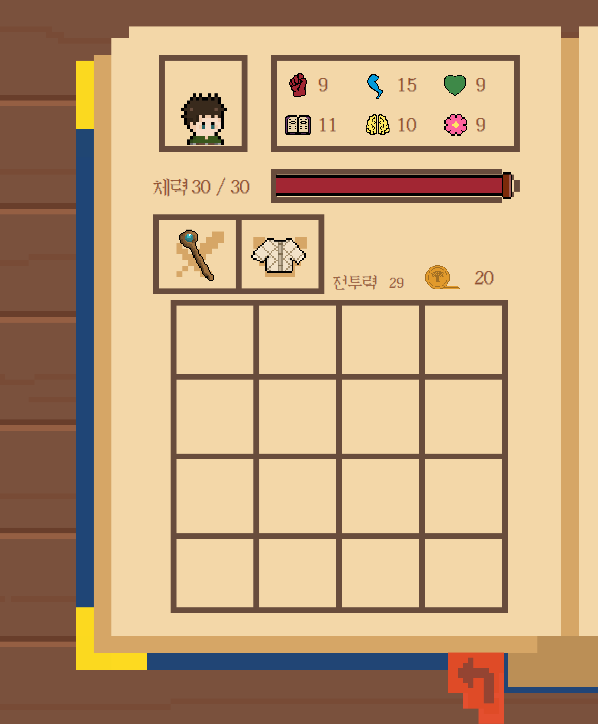
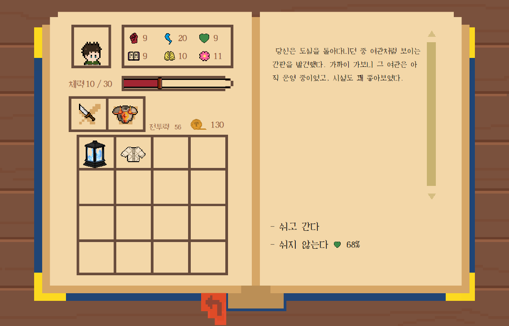
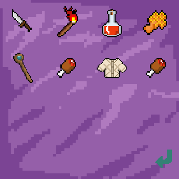

#  파파야 연대기

---

## 프로젝트 개요

파파야 연대기(Papaya Chronicle)는 WPF와 MVVM 패턴을 기반으로 만든 싱글플레이 텍스트 어드벤처 RPG입니다.
플레이어는 다양한 이벤트 선택을 통해 스토리를 진행하며, 전투, 능력치 성장, 아이템 사용 및 거래 등 RPG 요소를 경험할 수 있습니다.

---

## 주요 기능

### 1. 플레이어 시스템

* 능력치(Strength, HP, CombatPower) 상승 및 감소
* 인벤토리/장비 슬롯 관리
* 아이템 사용 효과 적용 (소모품, 무기, 방어구)
* 전투 결과 판정 및 스탯 변화



### 2. 이벤트/스토리 진행

* `GameEventManager` 중심의 이벤트 ID 기반 흐름 제어
* 챕터별 이벤트 파일 분리 (Chapter0~3 + Epilogue)
* 선택지에 따라 다른 스토리 또는 전투로 분기
* 확률 기반 성공/실패 판정 시스템



### 3. 거래 및 경제

* `Trader`를 통한 아이템 구매/판매
* 상점 재고 시스템
* 아이템 희귀도 및 가격 기반 밸런스



### 4. 저장/불러오기

* `GameSession` 전체 상태를 JSON으로 직렬화
* 게임 시작 시 저장 파일 존재 여부 확인
* 이어하기/새 게임 기능 제공

### 5. UI / UX (WPF)

* MVVM 기반 데이터 바인딩
* 스탯 창, 인벤토리, 장비창 UI
* 선택지 버튼 이벤트 처리
* 팝업 윈도우(경고, 알림, 거래, 능력치 분배 등) 제공
* BGM/효과음 볼륨 조절

---

## 프로젝트 구조

### 1. 📂 ViewModel

| 파일                   | 설명                                                                                                           |
| -------------------- | ------------------------------------------------------------------------------------------------------------ |
| **`GameSession.cs`** | 게임 전반의 상태를 보유하는 핵심 ViewModel. 모든 Model(Player, GameText, Trader, EventManager)을 통합하며 View와 바인딩되는 데이터의 중심 역할. |

---

### 2. 📂 Model

| 파일                                        | 역할 및 내용                                                    |
| ----------------------------------------- | ---------------------------------------------------------- |
| **`Player.cs`**                           | 플레이어 스탯, 체력, 골드 변화, 인벤토리/장비 관리 등 핵심 로직을 담당하는 캐릭터 모델.       |
| **`GameItem.cs`**                         | 아이템의 ID/이름/타입/효과/가격 등을 정의하는 기본 클래스. 장비/소모품 타입을 Enum으로 관리.  |
| **`GameText.cs`**                         | UI에서 사용되는 버튼 텍스트, 스탯 이름, 이미지 경로, 확률 문구 등을 담은 텍스트/리소스 모델.   |
| **`Trader.cs`**                           | 상점 재고 관리 및 아이템 구매/판매를 처리하는 상인 모델.                |
| **`PropertyChangedNotificationClass.cs`** | 모든 Model들이 상속받는 INotifyPropertyChanged 기반 MVP/MVVM 지원 클래스. |

---

### 3. 📂 Events

| 파일                                                                                                 | 설명                                                              |
|----------------------------------------------------------------------------------------------------|-----------------------------------------------------------------|
| **`GameEventManager.cs`**                                                                          | 모든 이벤트 흐름을 관리하는 핵심 클래스. 이벤트 ID 관리, 성공/실패 확률 판정, 전투 승리 판정 등을 수행. |
| **`Chapter0Events.cs`**, **`Chapter1Events.cs`**, **`Chapter2Events.cs`** ,**`Chapter3Events.cs`** | 주요 스토리 및 이벤트.                                                   |
| **`Epilogues.cs`**                                                                                 | 게임의 다양한 엔딩 텍스트 및 엔딩 분기 로직.                                      |

---

### 4. 📂 Items

| 파일                            | 설명                                            |
| ----------------------------- | --------------------------------------------- |
| **`ItemList.cs`**             | 게임 내 모든 아이템을 초기화하는 아이템 데이터베이스 클래스.            |
| **`ItemEffectDictionary.cs`** | 소모품 ID → 효과 함수 매핑. |

---

### 5. 📂 View

| 파일                                                                         | 설명                                            |
| -------------------------------------------------------------------------- | --------------------------------------------- |
| **`MainWindow.xaml`**                                                      | 앱의 기본 윈도우. BGM/효과음 전체 관리 및 첫 화면 로드.           |
| **`MainMenu.xaml`**                                                        | 새 게임/이어하기/종료 버튼을 제공하는 시작 메뉴.                  |
| **`Play.xaml`**                                                            | 게임 플레이 화면. 이벤트 텍스트 출력, 선택지 버튼, 스탯/인벤토리 UI 포함. |
| **`TradeWindow.xaml`**                                                     | 상인 거래 창 UI.                                   |
| **`StatUpWindow.xaml`**                                                    | 레벨업 시 스탯 분배 창.                                |
| **`NoticeWindow.xaml`**, **`NewGameCaution.xaml`**, **`YesNoWindow.xaml`** | 경고/알림/확인 팝업창.                                 |
| **`SettingWindow.xaml`**                                                   | BGM/효과음 볼륨 설정 UI.                             |

---

### 6. 📂 SaveService

| 파일                   | 설명                                         |
| -------------------- | ------------------------------------------ |
| **`SaveService.cs`** | GameSession 전체를 JSON으로 저장/불러오기하는 유틸리티 클래스. |

---

### 7. 📂 Resources

| 파일                   | 설명                                         |
|----------------------| ------------------------------------------ |
| **`Fonts`**          | 게임 내에서 사용하는 글꼴 파일(.ttf 등) 저장 폴더. |
| **`ItemImages`** | 아이템 아이콘 및 장비 이미지 리소스. |
| **`MainMenuImagess`** | 메인 메뉴 화면에서 사용되는 UI 이미지(배경, 버튼 이미지 등). |
| **`Musics`** | BGM 및 효과음 오디오 파일(.mp3, .wav 등). |
| **`PlayImages`** | 게임 플레이 화면(전투, 스탯, 배경 등)에 쓰이는 이미지. |
| **`SettingWindowimages`** | 설정 창에서 사용하는 이미지 리소스. |
| **`TradeImages`** | 상점/거래 UI에서 사용되는 이미지. |
| **`YesNoWIndowImages`** | 선택 팝업 창에서 쓰이는 UI 이미지. |


---

## 프로젝트 실행 방법

### 1\. 환경 설정

1.  **Visual Studio** 설치: C# 및 WPF 개발 환경이 필요합니다.
2.  **프로젝트 클론:** 이 저장소를 로컬 환경에 클론합니다.
    ```bash
    git clone https://github.com/Cha0910/Papayachronology.git
    ```
3.  **NuGet 패키지 설치:** 프로젝트를 빌드하기 전에 **Newtonsoft.Json** 패키지가 설치되어 있는지 확인합니다.

### 2\. 실행

1.  Visual Studio에서 프로젝트 파일을 엽니다.
2.  빌드 후 프로젝트를 실행합니다.
3.  메인 화면이 나타나며, '새로운 모험' 또는 '이어하기'를 선택하여 게임을 시작할 수 있습니다.

---

## 기술 스택

* **C#**
* **WPF / XAML**
* **MVVM 패턴**
* **Newtonsoft.Json (직렬화)**
* **MediaPlayer (BGM/효과음)**

---
